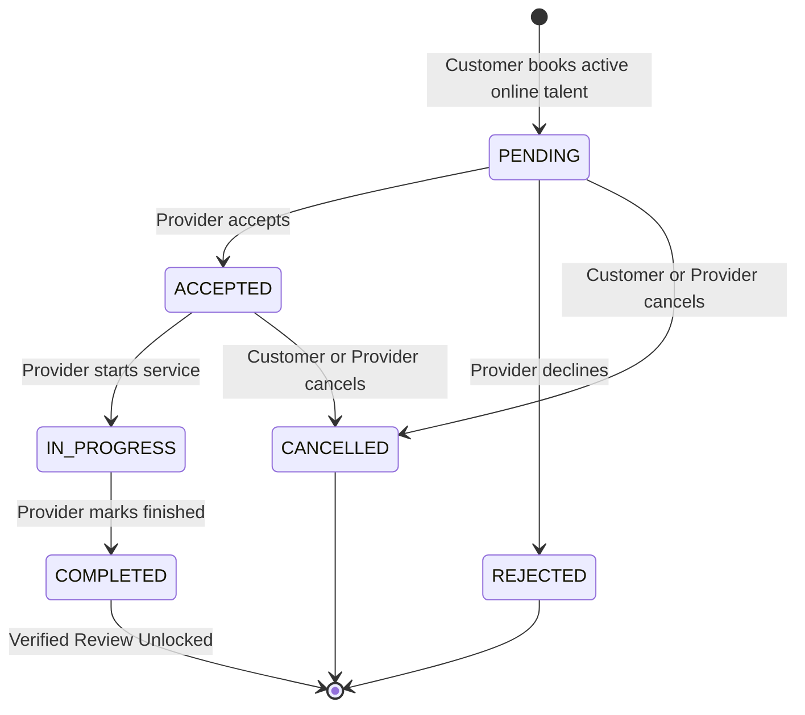

# VEGA System Architecture

VEGA is a smart, location-based service marketplace connecting local customers with nearby verified service providers. This document details the end-to-end software architecture, subsystem interactions, and design decisions.

---

## 1. High-Level Architecture

```
                                  [ CLIENT TIER ]
                             React 19 + Vite (SPA)
                                       │
                         HTTPS / JSON REST API / JWT
                                       │
                                       ▼
                             [ APPLICATION TIER ]
                          Django 5 + REST Framework
            ┌──────────────────────────┼──────────────────────────┐
            ▼                          ▼                          ▼
     [ Authentication ]        [ Core Business ]         [ Geospatial Discovery ]
       JWT Auth Engine       Single Active Talent Rule     Haversine / PostGIS Engine
      Accounts & Roles       State Machine Bookings      Radius Filtering (1-20 km)
            │                          │                          │
            └──────────────────────────┼──────────────────────────┘
                                       │
                                       ▼
                              [ DATABASE TIER ]
                          PostgreSQL 16 + PostGIS
                      Spatial Indexes & Constraints
```

---

## 2. Core Architectural Pillars

### A. Unified Single User Model
Unlike legacy platforms that divide users into rigid "customer" or "provider" accounts at registration:
- In VEGA, **every user is a Customer by default**.
- Any user can optionally enable **Provider Mode** from their profile settings (`is_provider=True`).
- A single account can seamlessly book services from other providers while offering services to nearby customers.

### B. Multiple Talents with Strict One-Active-Talent Rule
- A user can create and configure multiple service offerings (e.g. *Photography*, *Makeup*, *Hair Styling*), each with custom rates, descriptions, and experience.
- **Critical Business Rule**: A provider can have **ONLY ONE active talent** at any given moment.
- Enforced at both:
  1. **Database Constraint Layer**: Partial unique index `UNIQUE (user_id) WHERE (is_active = true)`.
  2. **Transactional Application Layer**: Row-locking `select_for_update()` inside atomic database transactions (`Talent.activate_single_talent()`) to guarantee zero race conditions during concurrent activations.

### C. Geospatial Radius Discovery Engine
- Stores exact decimal degrees (`latitude`, `longitude`) with spatial indexes.
- Search radius supports: `1 km`, `2 km`, `5 km`, `10 km`, `20 km`.
- Uses high-speed bounding box pre-filtering followed by exact spherical Haversine distance computations:
  $$d = 2 R \arcsin\left(\sqrt{\sin^2\left(\frac{\Delta \text{lat}}{2}\right) + \cos(\text{lat}_1)\cos(\text{lat}_2)\sin^2\left(\frac{\Delta \text{lon}}{2}\right)}\right)$$
- Providers appear in discovery **only if**:
  1. `is_provider == True`
  2. `is_online == True`
  3. Exactly one talent is `is_active == True`
  4. Location coordinates are valid
  5. Distance $\le$ Search Radius

### D. Concurrency-Safe Booking State Machine
Bookings transition through a deterministic finite state machine with strict actor role permissions:


