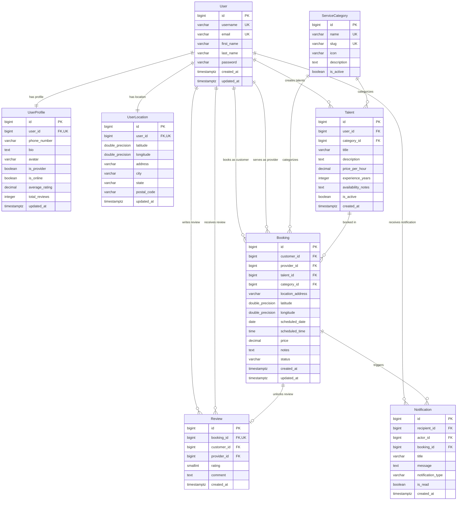

# VEGA Database Schema & Entity Documentation

This document describes the PostgreSQL/PostGIS database design, table structures, constraints, indexes, and entity relationships for the VEGA platform.

---

## 1. Entity-Relationship (ER) Diagram



---

## 2. Table Specifications

### `vega_users` (Unified User Account)
| Field | Type | Constraints | Description |
| :--- | :--- | :--- | :--- |
| `id` | `BIGINT` | `PRIMARY KEY, AUTO_INCREMENT` | Unique user identifier |
| `username` | `VARCHAR(150)` | `UNIQUE, NOT NULL` | Unique user handle |
| `email` | `VARCHAR(254)` | `UNIQUE, NOT NULL, INDEXED` | User email for auth |
| `first_name` | `VARCHAR(150)` | `NOT NULL` | Given name |
| `last_name` | `VARCHAR(150)` | `NOT NULL` | Surname |
| `password` | `VARCHAR(128)` | `NOT NULL` | Argon2 / PBKDF2 hashed password |
| `is_active` | `BOOLEAN` | `DEFAULT TRUE` | Account status flag |
| `created_at` | `TIMESTAMPTZ` | `DEFAULT NOW()` | Registration timestamp |

---

### `vega_user_talents` (Multiple Talents & One-Active Rule)
| Field | Type | Constraints | Description |
| :--- | :--- | :--- | :--- |
| `id` | `BIGINT` | `PRIMARY KEY, AUTO_INCREMENT` | Unique talent ID |
| `user_id` | `BIGINT` | `FOREIGN KEY(vega_users.id), NOT NULL` | Provider user |
| `category_id` | `BIGINT` | `FOREIGN KEY(vega_service_categories.id)` | Service category |
| `title` | `VARCHAR(150)` | `NOT NULL` | Talent title |
| `description` | `TEXT` | `NOT NULL` | Service details & tooling |
| `price_per_hour` | `DECIMAL(10,2)` | `NOT NULL` | Standard rate in USD/currency |
| `experience_years`| `INTEGER` | `NOT NULL, DEFAULT 1` | Years of experience |
| `is_active` | `BOOLEAN` | `NOT NULL, DEFAULT FALSE` | Active/online talent flag |

#### ⚠️ One-Active-Talent Constraint
```sql
CREATE UNIQUE INDEX unique_active_talent_per_user 
ON vega_user_talents (user_id) 
WHERE (is_active = TRUE);
```
*Enforcement*: A user can have $N$ talents, but at most 1 talent row with `is_active = true`. Attempting to save a second active talent triggers an immediate DB `IntegrityError`.

---

### `vega_user_locations` (Geospatial Location)
| Field | Type | Constraints | Description |
| :--- | :--- | :--- | :--- |
| `id` | `BIGINT` | `PRIMARY KEY, AUTO_INCREMENT` | Location record ID |
| `user_id` | `BIGINT` | `FOREIGN KEY(vega_users.id), UNIQUE` | Owner user |
| `latitude` | `DOUBLE PRECISION` | `NOT NULL, CHECK(-90 <= lat <= 90)` | Decimal latitude |
| `longitude` | `DOUBLE PRECISION` | `NOT NULL, CHECK(-180 <= lng <= 180)`| Decimal longitude |
| `address` | `VARCHAR(255)` | `DEFAULT ''` | Street address |
| `city` | `VARCHAR(100)` | `DEFAULT ''` | City name |
| `updated_at` | `TIMESTAMPTZ` | `AUTO_NOW` | Last location ping timestamp |

*Index*: `CREATE INDEX idx_locations_lat_lon ON vega_user_locations (latitude, longitude);`

---

### `vega_bookings` (State Machine Bookings)
| Field | Type | Constraints | Description |
| :--- | :--- | :--- | :--- |
| `id` | `BIGINT` | `PRIMARY KEY, AUTO_INCREMENT` | Booking ID |
| `customer_id` | `BIGINT` | `FOREIGN KEY(vega_users.id)` | Ordering customer |
| `provider_id` | `BIGINT` | `FOREIGN KEY(vega_users.id)` | Service provider |
| `talent_id` | `BIGINT` | `FOREIGN KEY(vega_user_talents.id)` | Chosen talent |
| `category_id` | `BIGINT` | `FOREIGN KEY(vega_service_categories.id)`| Snapshot category |
| `status` | `VARCHAR(20)` | `DEFAULT 'PENDING', INDEXED` | `PENDING`, `ACCEPTED`, `REJECTED`, `CANCELLED`, `IN_PROGRESS`, `COMPLETED` |
| `price` | `DECIMAL(10,2)` | `NOT NULL` | Locked service rate |
| `scheduled_date`| `DATE` | `NOT NULL` | Appointment date |
| `scheduled_time`| `TIME` | `NOT NULL` | Appointment time |

---

### `vega_reviews` (Verified Customer Reviews)
| Field | Type | Constraints | Description |
| :--- | :--- | :--- | :--- |
| `id` | `BIGINT` | `PRIMARY KEY, AUTO_INCREMENT` | Review ID |
| `booking_id` | `BIGINT` | `FOREIGN KEY(vega_bookings.id), UNIQUE` | One review per completed booking |
| `customer_id` | `BIGINT` | `FOREIGN KEY(vega_users.id)` | Author customer |
| `provider_id` | `BIGINT` | `FOREIGN KEY(vega_users.id)` | Recipient provider |
| `rating` | `SMALLINT` | `NOT NULL, CHECK(1 <= rating <= 5)` | 1 to 5 star rating |
| `comment` | `TEXT` | `NOT NULL` | Review feedback |
| `created_at` | `TIMESTAMPTZ` | `DEFAULT NOW()` | Submission timestamp |
